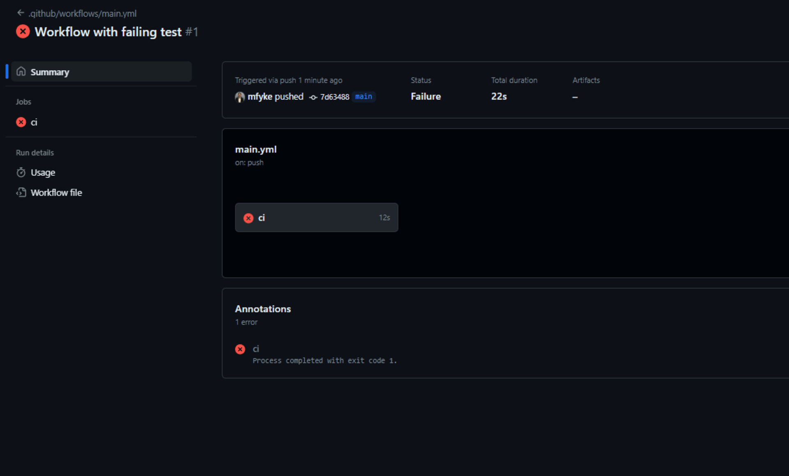

# Instructor Demo: GitHub Actions with Tests

## Setup Github Actions to run tests

1. Using the same repo you cloned earlier, in your code editor, open `.github/workflows/main.yml` and add the following content:

    ```yml
    # Name of workflow
    name: Lint  and Test workflow

    # Trigger workflow on all pull requests
    on:
    pull_request:
        branches:
        - develop
        - staging
        - main

    # Jobs to carry out
    jobs:
    test:
        # Operating system to run job on
        runs-on: ubuntu-latest

        # Steps in job
        steps:
        # Get code from repo
        - name: Checkout code
            uses: actions/checkout@v1

        - name: Use Node.js 20.x
            uses: actions/setup-node@v1
            with:
            node-version: 20.x

        # Install dependencies
        - name: 🧰 install deps
            run: npm install
            
        # Run lint
        - name: Run lint
            run: npm run lint

        # Run build
        - name: Run Build
            run: npm run build

        # Run tests
        - name: Test
            run: npm run test
    ```

    * **yml** is a human-readable language intended for config files that are used with programs that store or transmit data. Think of yml, or **YAML**, as a more readable version of XML or JSON.

    * The first part of the file tells GitHub that when a PR is created against the `develop`, `staging`, or `main` branch, some work should be performed.

      ```yml
      on:
        pull_request:
            branches:
            - develop
            - staging
            - main
      ```

    * The latter half of this file tells GitHub that the action should be run on a container using the latest version of Ubuntu, a popular Linux distribution. A **container** is a virtual machine that runs on a server either locally or remotely. In this case, the container is being hosted by GitHub. Refer to the following example:

      ```yml
      jobs:
        test:
            # Operating system to run job on
            runs-on: ubuntu-latest
      ```

    * The `main.yml` file also specifies some actions, This GitHub Actions workflow performs several automated steps whenever triggered: it checks out the code from the repository, sets up Node.js version 20.x, installs the project dependencies using npm install, runs the linter to check for code style issues, builds the project, and finally runs the tests to ensure everything is functioning correctly. Each step is defined with a name and an action, either using a predefined GitHub action or running a command directly.:

      ```yml
          steps:
            # Get code from repo
            - name: Checkout code
                uses: actions/checkout@v1

            - name: Use Node.js 20.x
                uses: actions/setup-node@v1
                with:
                node-version: 20.x

            # Install dependencies
            - name: 🧰 install deps
                run: npm install
                
            # Run lint
            - name: Run lint
                run: npm run lint

            # Run build
            - name: Run Build
                run: npm run build

            # Run tests
            - name: Test
                run: npm run test
      ```

## Finishing Up

* Once you save your secret, the workflow setup should be complete and we just need to test it.

* Frst, we need to add and commit the current changes and push to GitHub. Once we do this, we should see the workflow invoked.

* Commit your changes, as follows:

    ```sh
    git add -A
    git commit -m "Workflow with failing test"
    git push origin main
    ```

* Any changes that are made to your `main` branch will invoke your CD workflow on GitHub. Currently we have a failing test, so the action should fail and no deployments should have been triggered, as shown:

    

## Conclusion

It's important for tests to pass in GitHub Actions when any Pull Request is created because it ensures that new changes do not introduce bugs or break existing functionality. Automated tests verify that the code behaves as expected, maintaining the project's stability and reliability. This helps catch issues early in the development process, improves code quality, and ensures a smoother integration of new features or fixes.